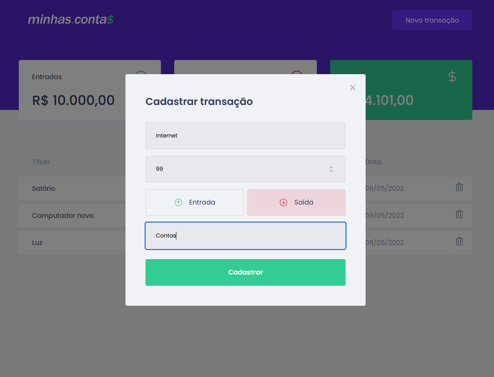

## 💻 Sobre o projeto

O minhas.conta$ é uma aplicação de controle financeiro, onde é possível cadastrar e excluir transações e ver o saldo de entrada e saída 💰

<h1 align="center">
    
</h1>

<br>

## 🧪 Tecnologias usadas

Esse projeto foi desenvolvido com as seguintes tecnologias:

- [Vite](https://vitejs.dev/)
- [React](https://reactjs.org)
- [TypeScript](https://www.typescriptlang.org/)
- [SCSS](https://sass-lang.com/)
- [Styled-Components](https://styled-components.com/)

## 🔗 Clone a aplicação

Clone o projeto e acesse a pasta do mesmo.

```bash
$ git clone https://github.com/brunofilho1/minhas-contas
$ cd minhas-contas
```

## 🚀 Como iniciar a aplicação

Para iniciá-lo, siga os passos abaixo:

```bash
# Instalando dependências:
$ yarn

# Rodando em modo de desenvolvimento:
$ yarn dev
```

<h1 align="center">
    
</h1>

<h1 align="center">
    
</h1>

O app estará disponível no seu browser pelo endereço http://localhost:3000 assim que iniciado.

## 🌐 Live preview

<a src="https://brunofilho1.github.io/minhas-contas/" target="_blank">https://brunofilho1.github.io/minhas-contas/</a>
